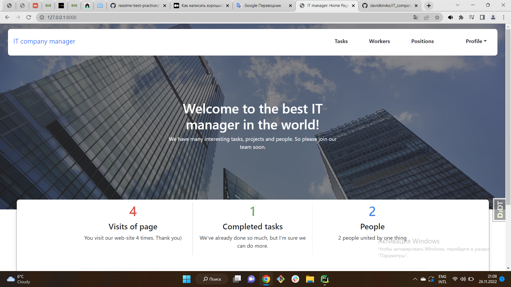
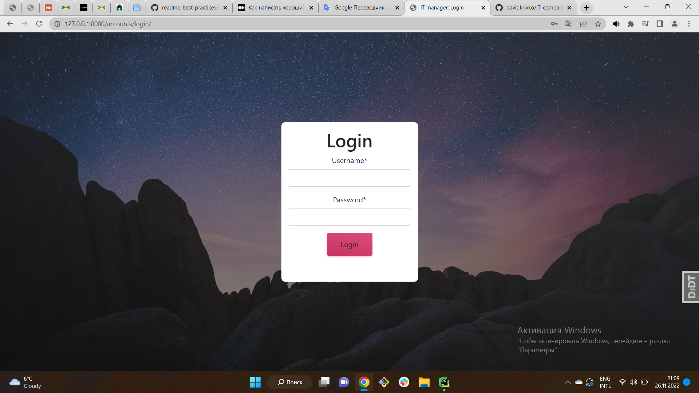
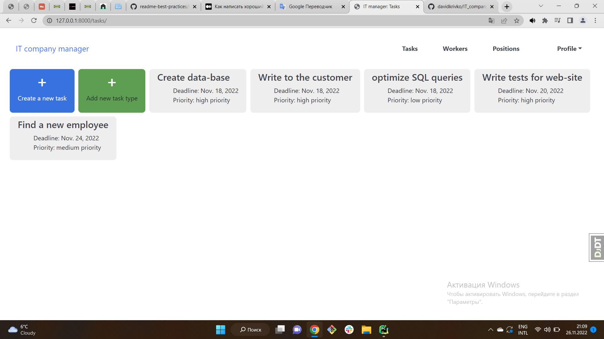
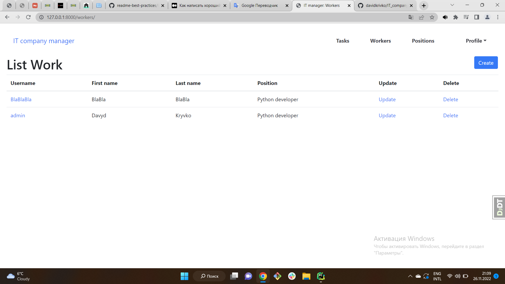

# IT_company_task_manager

> Additional info

IT manager is a convenient manager for any IT company. 
You can track your tasks, create new ones and delete them as well.


## Installation

Python3 must be already installed

```shell
git clone https://github.com/davidkrivko/IT_company_task_manager.git
cd IT_company_task_manager
python3 -m venv venv
source venv/bin/activate
pip install -r requirements.txt
python manage.py runserver
```

## Add database

```shell
python manage.py makemigrations
python manage.py migrate
```

## Functions

```shell
1) You can create, edit and delete your tasks.
2) You can track the number of times you have visited the main page of the project
3) You can create, edit and delete your workers
4) You can create, edit and delete positions of your workers
5) You can create new task types on the public site,delete and edit only on the admin page
6) All pages except the main one are not available for non-registered users
7) Employees of the company are users of this site
```

## Visual web-site





